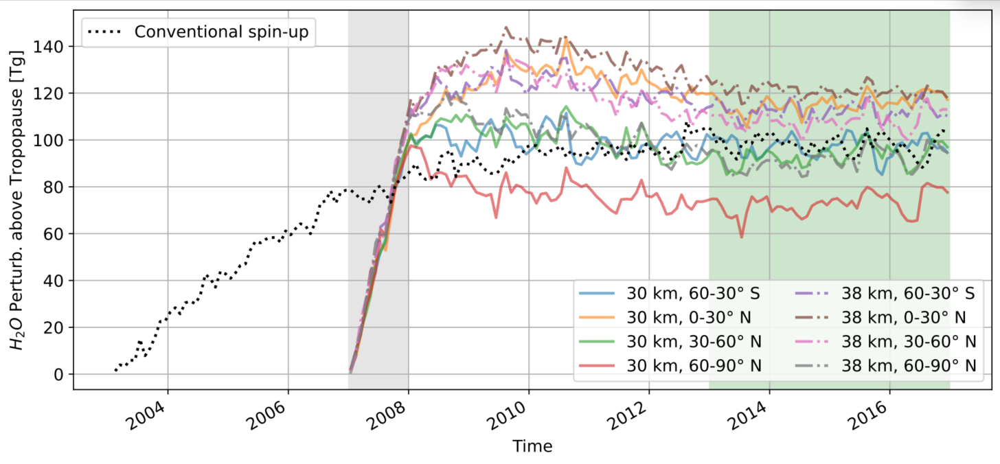

# Stratospheric Perturbation Lifetimes

This repository provides a compact workflow to estimate stratospheric perturbation lifetimes of water vapour (`tau`) and derive a model speed-up factor (`s`) for high-altitude aircraft emission studies. The timeline diagram shows how emissions are scaled with factor `s` in year 1 and then reset to baseline in later years, while preserving the intended perturbation response in general circulation model simulation results



## What This Repository Does

- Computes perturbation lifetime of water vapour (`tau`) from published reference points.
- Estimates `tau` across stratospheric altitudes with interpolation and extrapolation.
- Computes correction factor `s` for first-year accelerated perturbation experiments.

## Repository Contents

- `calculate-factor-s_and_tau-values.ipynb`: Derivation of `s`, lifetime estimation workflow, and a plotting example.
- `figures/speed-up_timeline.pdf`: Timeline figure that illustrates the first-year speed-up method in model simulations.

## Scientific Context

In high-speed aircraft scenarios, emissions are injected in the stratosphere. Emitted trace gases are transported and chemically transformed through the middle atmosphere before most perturbations are transferred to the troposphere, where removal processes are generally faster.

Perturbation lifetime of water vapour (`tau`) is used here as an effective transport/removal timescale from emission altitude toward tropospheric removal.

## Quickstart

1. Install dependencies:

```bash
pip install numpy scipy matplotlib jupyterlab
```

2. Open the notebook:

```bash
jupyter lab calculate-factor-s_and_tau-values.ipynb
```

3. Run cells top-to-bottom to reproduce the interpolation, figure, and `s` values.

## Limitations

- Input lifetimes are based on a small number of altitude points.
- The `s ~= tau + 0.5` approximation is most reliable for `tau` values in the range used in the notebook.
- Scenario-specific chemistry and altitude-distributed emissions can require more detailed treatment.

## References

- Grewe, V., and Stenke, A. (2008): Source of lower stratospheric water vapor trend and its impact on climate.
- Pletzer, Johannes and Grewe, Volker (2024): "Sensitivities of atmospheric composition and climate to altitude and latitude of hypersonic aircraft emissions". DOI: https://doi.org/10.5194/acp-24-1743-2024
- Pletzer, Johannes (2024): *Dissertation: The climate impact of hypersonic transport*, Figure 3.10. DOI: https://doi.org/10.4233/uuid:39acca9a-53ba-4b9c-b9c0-b6c99f552e25


